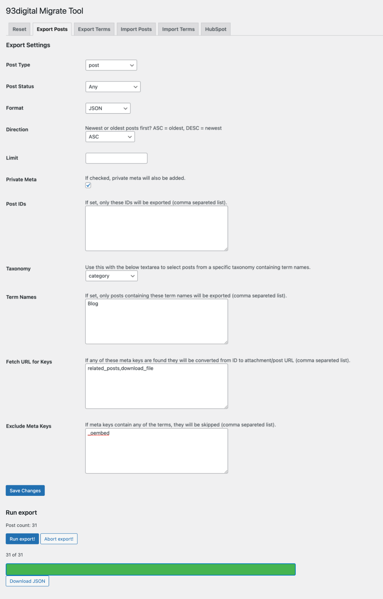

# Export Posts

This page will allow admins to export any of the post types set up in the current WordPress installation.

URL: `[SITE URL]/wp-admin/admin.php?page=nine3-migrate-page&tab=export`

## Settings

To start the export save the following settings:

| Setting | Field | Description |
|---|---|---|
|Post Type|select|Choose post type to export using dropdown|
|Post Status|select|Choose post status to export ('Any' will export all)|
|Format|select|JSON or CSV (JSON is recommended if re-importing back using this plugin)|
|Direction|select|Newest or oldest posts first? ASC = oldest, DESC = newest|
|Limit|number|Limit the amount of posts to export|
|Private Meta|checkbox|If checked, all private meta will be included in the export|
|Post IDs|textarea (comma separated list)|Add a list of post IDs to only export those posts|
|Taxonomy|select|Select a taxonomy (along with Term names below to only export posts with those Terms|
|Term Names|textarea (comma separated list)|Add list of Term names to export only those posts|
|Fetch URL for Keys|textarea (comma separated list)|If any of these keys are found, the value (if ID) will be converted to a post/attachment URL|
|Exclude Meta Keys|textarea (comma separated list)|If any meta keys contain these terms, they will not be included in the export|

Once saved click Run Export and a progress bar will pop up and fill as the posts are exported, once finished a Download button will appear below the progress bar. You can also open up the developer console and check the log to see how the progress is going (see screenshots below for reference).




## Background

The export is initiated with an `XMLHttpRequest` in the `js/migrate.js` file. The script collects form data and sends a request to a `wp_ajax_nine3-run-export` action in `class/class-nine3-migrate.php`. This action then fires up the export class in `class-nine3-export-process.php`, which creates a temporary PHP file and places it in a custom `nine3-migrate` folder located in the wp-content uploads directory. Then the class collects all the required post data and appends it to the generated PHP file, once this is done the offset is incremented and a response is sent back to the JS. The process is looped until there are no more posts, when this is the case the temporary PHP file gets converted into a JSON (or CSV) file and the path to that file is returned to the JavaScript - which in turn prints it in the form of a button. Simple.

### Sample JSON

[Download Sample](sample/nine3-export-sample.json)

```json
[
    {
        "ID": 496,
        "post_date": "2021-05-10 15:31:07",
        "post_title": "Hello world",
        "post_name": "hello-world",
        "post_type": "post",
        "post_status": "publish",
        "guid": "Hello World",
        "post_excerpt": "",
        "post_parent": 0,
        "post_author": "93digital,devs@93digital.co.uk",
        "featured_image": "http:\/\/localhost\/sandbox/wp-content\/uploads\/sites\/2\/2021\/05\/hero.png",
        "nine3_tax": {
            "insight-type": "News,Report"
        },
        "nine3_meta": {
            "nine3_migrate": "",
            "background-color": "",
            "text-color": "",
            "_edit_last": "1",
            "_edit_lock": "1620833499:1",
            "_is_gated": "",
            "_thumbnail_id": "563",
            "_wp_desired_post_slug": "",
            "_wp_old_date": "",
            "_wp_old_slug": ""
        }
    },
    {
        "ID": 537,
        "post_date": "2021-05-18 18:59:41",
        "post_title": "This is a post",
        "post_name": "this-is-a-post",
        "post_type": "post",
        "post_status": "publish",
        "guid": "http:\/\/localhost\/sandbox/?p=537",
        "post_content": "Lorem ipsumn",
        "post_excerpt": "",
        "post_parent": 0,
        "post_author": "93digital,devs@93digital.co.uk",
        "featured_image": "http:\/\/localhost\/sandbox\/wp-content\/uploads\/sites\/2\/2021\/06\/hero.jpg",
        "nine3_meta": {
            "nine3_migrate": "",
            "background-color": "",
            "text-color": "",
            "_edit_last": "1",
            "_edit_lock": "1620833499:1",
            "_is_gated": "",
            "_thumbnail_id": "563",
            "_wp_desired_post_slug": "",
            "_wp_old_date": "",
            "_wp_old_slug": ""
        }
    },
]
```

### Sample CSV

[Download Sample](sample/nine3-export-sample.csv)

