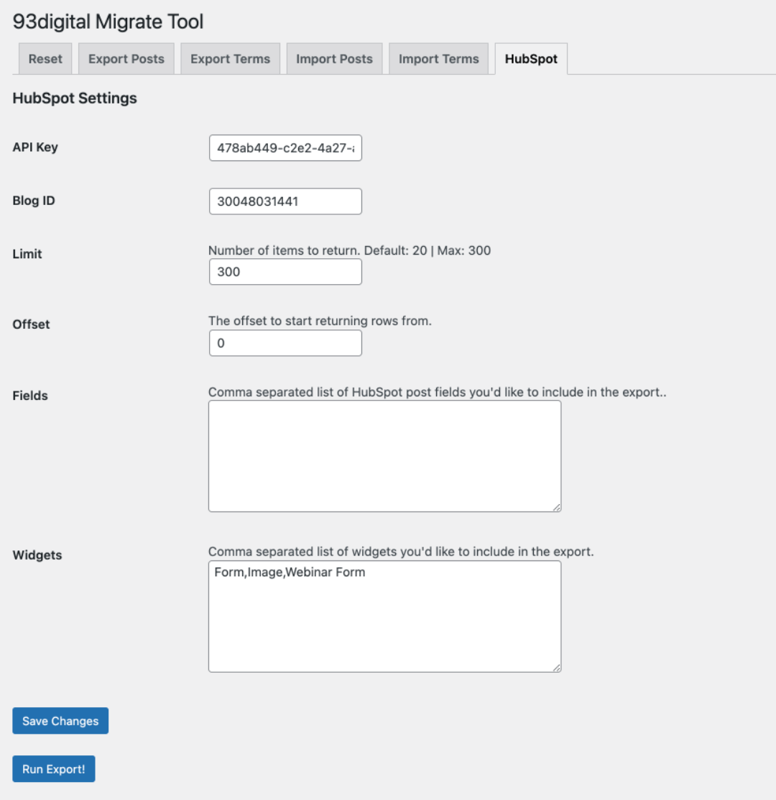

# HubSpot

This area allows you to export HubSpot blog posts as JSON provided you have the API key. You can then feed this JSON file back into the Import Post function.

URL: `[SITE URL]/wp-admin/admin.php?page=nine3-migrate-page&tab=hubspot`

## Settings

To start the export save the following settings:

| Setting | Field | Description |
|---|---|---|
|API Key|text|Copy the API key from you HubSpot account (must have admin privelages)|
|Blog ID|text|Enter the specific blog you'd like to run the export on|
|Limit|number|The API is limied to 300 posts at a time|
|Offset|number|Specify the position of posts (useful if blog contains more than 300 posts)|
|Fields|textarea (comma separated list)|Add extra HubSpot post fields to export, defaults are listed below|
|Widgets|textarea (comma separated list)|Add any widgets added to the post you would like to export (this data will be serialized)|

Default export fields:
- blog_post_author
- featured_image
- id
- language
- meta_description
- post_body
- post_summary
- publish_date
- slug
- title
- topics

## Background

Once the API key and the blog ID is set the plugin will attempt to connect to the HubSpot instance and fetch data using [wp_remote_get()](https://developer.wordpress.org/reference/functions/wp_remote_get/). If there are errors with the request or the API the error message will be displayed on the page.

If the request is successful the data is retrieved for each post, if there are topics set for the post, additional API requests are made to get the names of them and add to post data. Once this is done the posts data array is written to a temporary PHP file and the page is reloaded to display a `Download JSON` button. Clicking this will encode the PHP file into JSON, download it in the browser and delete the temporary PHP file.

If any widgets have been included in the export the data they contain (usually within multidimensional arrays) will be serialized. There has to be a lovel of manual dev work in order to unserialize it and use it in a meaningful way when importing, this can be done via the `nine3_migrate_before_insert_data` filter.