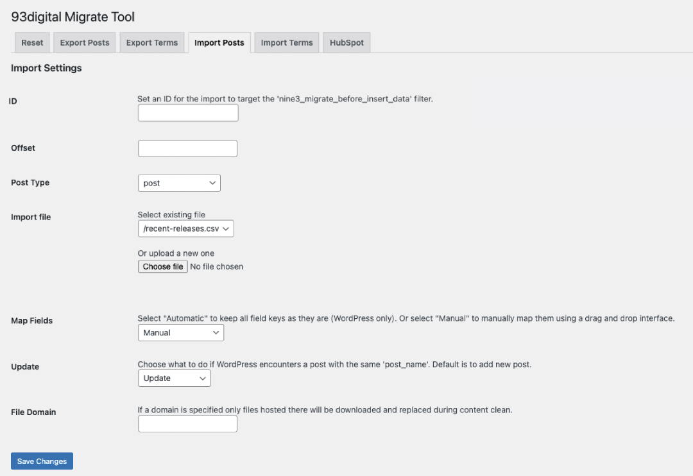
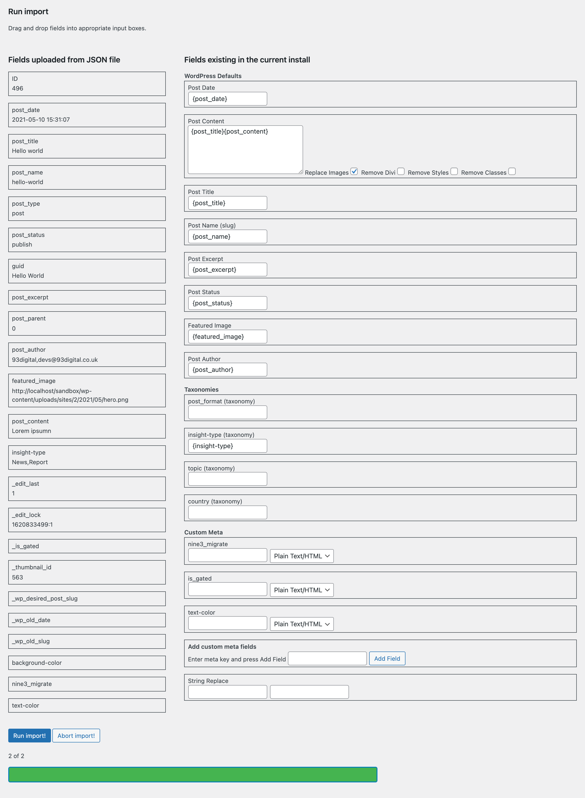
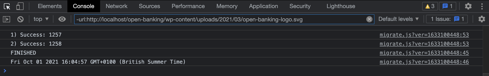

# Import Posts

This is where you will be able to upload either a CSV or JSON and begin importing your content into your new WordPress site.

URL: `[SITE URL]/wp-admin/admin.php?page=nine3-migrate-page&tab=import`

## Settings

To start the import save the following settings:

| Setting | Field | Description |
|---|---|---|
|ID|text|Set an ID for this import to target it via the `nine3_migrate_before_insert_data__[ID]` filter|
|Offset|number|Specify at which point in the file to start the import|
|Post Type|select|Which post type to add the posts to|
|Import file|select/file|Choose from files already uploaded or choose new file to upload|
|Map Fields|select|Select "Automatic" to import all the meta keys, taxonomies and WordPress fields exactly as they are (WordPress only). Or select "Manual" to manually map keys using a drag and drop interface|
|Update|select|Choose how to handle posts with duplicate post names|
|File domain|text|Restrict file download/upload from only that domain|

Once this is saved (and if Map Fields is set to Manual) a drag and drop interface will appear with all the fields in the import file alongside default WordPress fields for the post type (this includes available meta data and taxonomies).

As with the export, you can check the console log for progress and errors:

## Fields

On the left hand side you will see a sample of all of the fields uploaded in the JSON/CSV file, on top is the field key and bottom is a sample of the value. You can drag and drop any of the fields on the left into any input fields on the right, this is important later as it will govern where the migration script looks for the data in the JSON/CSV file. You'll also see that when dropped the field keys are wrapped in curly braces e.g. `{post_content}` - these have to be present for the script to unwrap them and use as keys.

The fields on the right hand side are split into headings: WordPress Defaults, Taxonomies and Custom Meta. All of these are populated automatically by scanning the existing install, for the most part they are also relatively self explanatory, with the exception of Post Content.

Post Content allows multiple fields to be mapped across and added to the post, these will be appended to post content in the order they are in the textarea. See [Hooks](hooks.md) for info on how to add filters and inject custom HTML for each of these keys. There are also four options which clean up the post content, these are:

- Replace Images
    - This scans post content for `` tags, downloads the source, re-uploads it to the new site and replaces the source URL
- Remove Divi
    - Removes all Divi shortcodes in post content
- Remove Styles
    - Removes all inline styles
- Remove Classes
    - Removes all classes

At the bottom you'll see an input field which allows you to add more custom meta fields, simply enter the meta key, click Add Field and then drag and drop (or manually type) a field from the left column. If the meta doesn't exist, this meta key/value pair will be created when the posts are added.

There's also an ooportunity to run a string replace, note that this will be applied to all the fields in the import file.
## Background

Once you click run import all of the form data (the keys we just mapped out as well as offset, import file location, post type, etc.) is collected in the `migrate.js` script and sent to the `wp_ajax_nine3-run-import` action in `class/class-nine3-migrate.php`. This triggers the import process class in `class-nine3-import-process.php`.

The import process class performs several functions:

- Converts import file to PHP array
- Converts posted form data of mapped keys to PHP array
- Registers offset
- Using a while loop and given offset, picks out a post to import from the import file
- Figures out which of the mapped data keys belong to which WordPress fields
- Runs a host of cleanup functions for content/files/taxonomies
- Imports the post into WordPress
- Increments offset
- Returns feeadback data (including new offset) to `migrate.js`

The process is then repeated until the while loop is satisfied (meaning the offset has reached the total number of items in the import file).